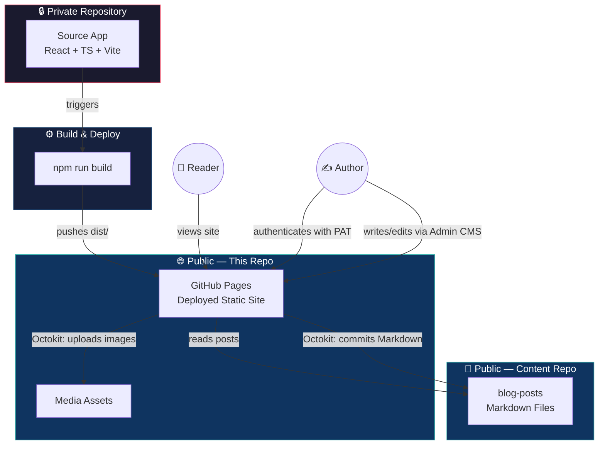

# 📝 My Learning Diary

> A serverless, Git-backed personal blog — written in Markdown, published straight to GitHub, and deployed automatically. No database. No backend server. Just Git as the source of truth.

**[🚀 View the live site →](https://Mzaq1559.github.io/My-Learning-Diary)**

---

## 📌 What is this

**My Learning Diary** is a full-stack blogging platform I built from scratch — a React/TypeScript frontend paired with a **custom, in-browser Content Management System** that publishes directly to GitHub, with no traditional backend or database anywhere in the stack.

This repository is the **deployed build artifact** — the compiled static site served live by GitHub Pages. The full application source (the React app, the Admin CMS, the GitHub API integration) lives in a separate private repository, since it manages authenticated write access to my content.

---

## ✨ Highlights

- **Zero-backend architecture** — Git *is* the database. Posts are Markdown files, media is committed as binary assets, and GitHub's REST API handles all reads and writes.
- **Custom in-browser CMS** — a full Markdown editor with live GitHub-style preview, built with `@uiw/react-md-editor`, authenticated via a GitHub Personal Access Token.
- **One-click publishing** — writing and saving a post from the Admin Dashboard commits directly to a dedicated content repository via Octokit, no CI pipeline required for content updates.
- **Polished reader experience** — glassmorphic UI, smooth page transitions with Framer Motion, tag/category browsing, and a few playful extras (floating music player, Live2D widget).
- **Three-repo separation of concerns** — source code, built site, and content each live in their own repository, mirroring how a production static-site pipeline would separate build, deploy, and content stages.

---

## 🏗 Architecture

Three repositories, each with a single responsibility — source, deployed site, and content are fully decoupled, so publishing a post never touches code and shipping code never touches content.

**How a post gets published:** the Author never touches this repo or the source repo directly — they log into the *live* Admin Dashboard, write in the Markdown editor, and hit publish. That commits straight to `blog-posts` via the GitHub REST API. No CI run, no redeploy, no downtime.

**How the site itself gets updated:** a code change in the private source repo is built with Vite and the resulting `dist/` is pushed here, where GitHub Pages serves it.

**Stack:** React 18 · TypeScript · Vite · Tailwind CSS · React Router · Framer Motion · Octokit (GitHub REST API)

---

## 📂 About this repository specifically

This repo contains the **compiled output** served by GitHub Pages — generated by `npm run build` in the source app and pushed here as part of deployment. It also stores media assets uploaded through the CMS.

| Piece | Location |
|---|---|
| Application source (React app + Admin CMS) | Private repository |
| Blog post content (Markdown) | [`blog-posts`](https://github.com/Mzaq1559/blog-posts) |
| **Live deployed site (this repo)** | `My-Learning-Diary` |

Since this repo is generated output rather than hand-written source, it's kept read-only in practice — all real development happens upstream. If you're curious about the implementation (the CMS internals, the GitHub API integration, the editor), that lives in the private source repo; happy to walk through it if you reach out.

---

## 🔗 Links

| | |
|---|---|
| 🚀 **Live Site** | [Mzaq1559.github.io/My-Learning-Diary](https://Mzaq1559.github.io/My-Learning-Diary) |
| 📄 **Content Repo** | [github.com/Mzaq1559/blog-posts](https://github.com/Mzaq1559/blog-posts) |
| 👤 **Author's GitHub** | [github.com/Mzaq1559](https://github.com/Mzaq1559) |

> The private source repository (React app + Admin CMS implementation) isn't publicly linked here — reach out via GitHub if you'd like a walkthrough.

---

## 👤 About the author

Built by **[Muhammad Zulqarnain](https://github.com/Mzaq1559)** — BSc Computer Science student, backend/full-stack developer, and someone who apparently thinks "I'll just add a CMS" is a reasonable Tuesday.
