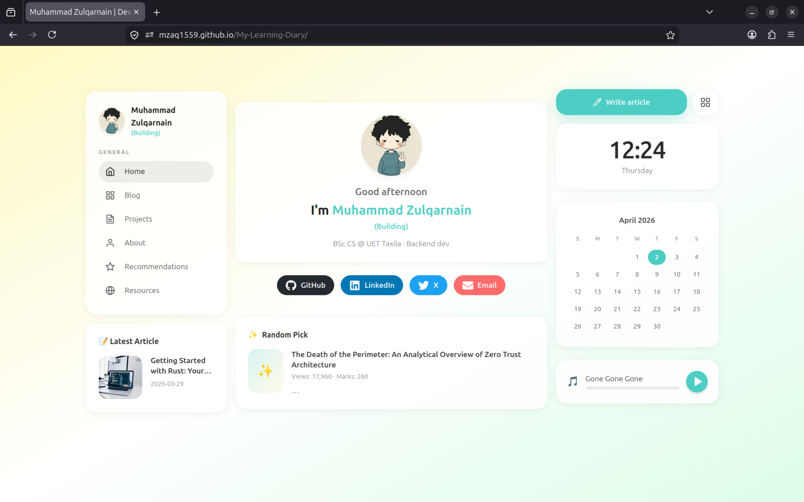
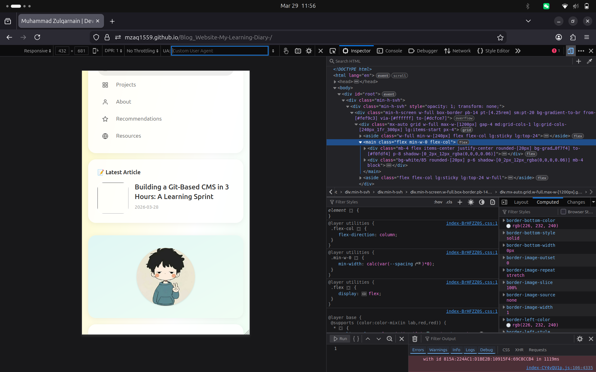
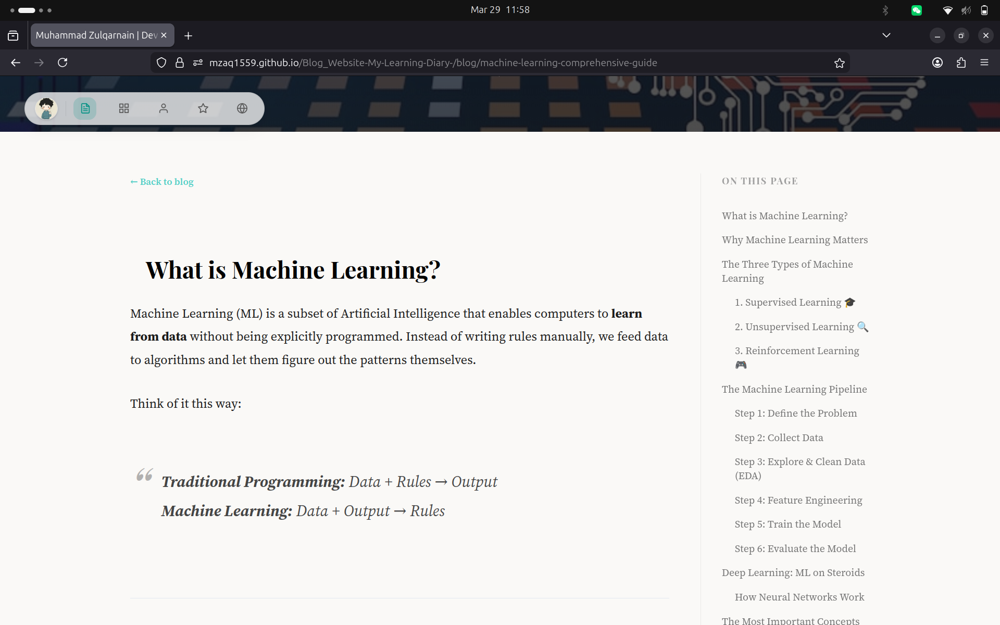
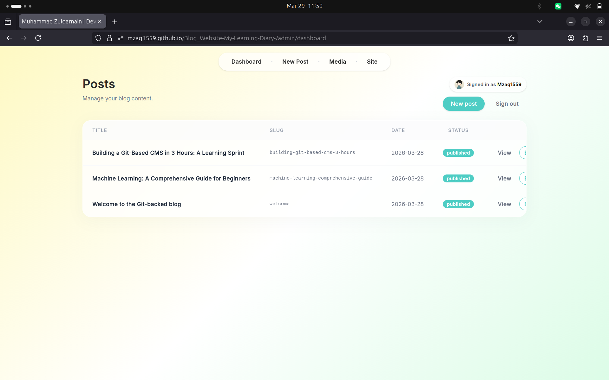
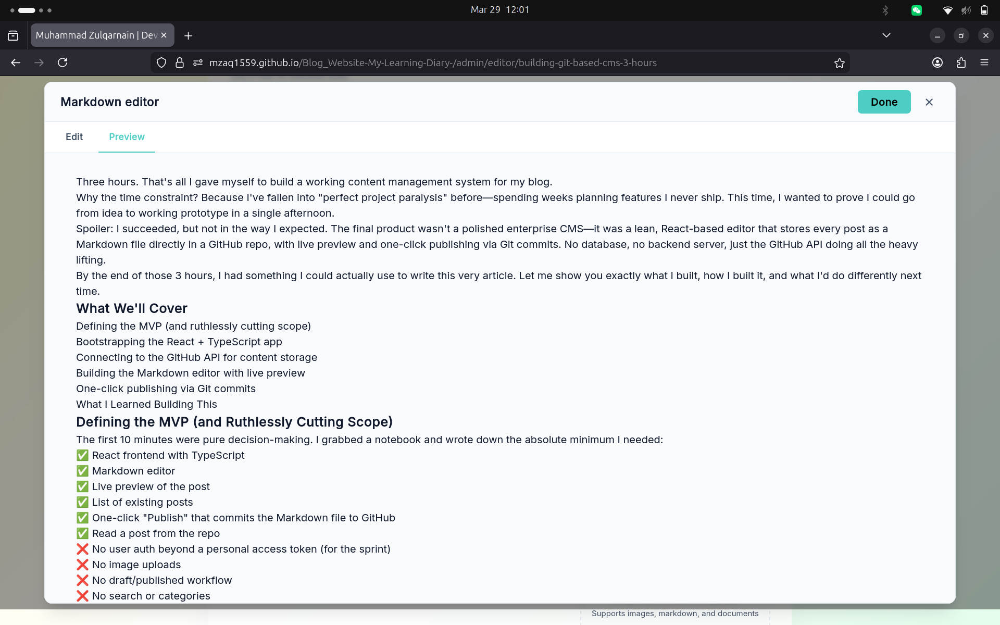
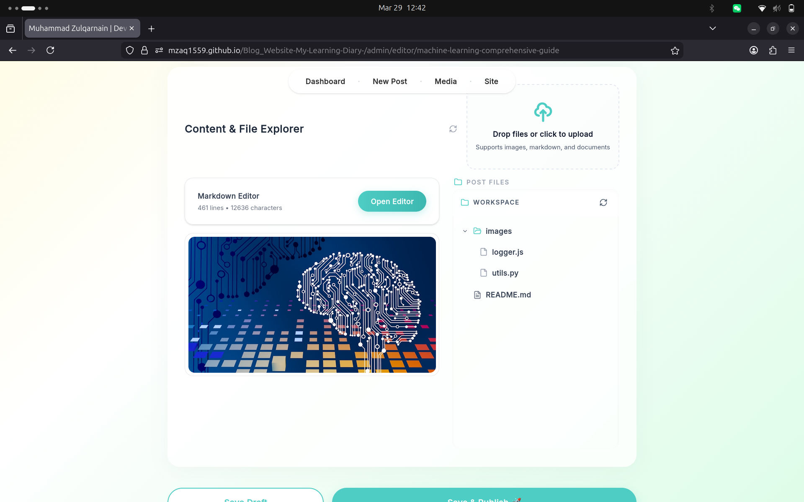
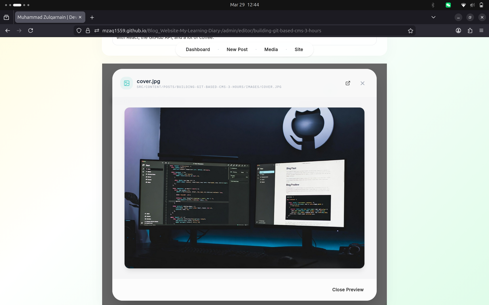

# 📝 My Learning Diary

> A serverless, Git-backed blog CMS — write in Markdown, publish to GitHub, deploy automatically.

[](https://reactjs.org/)
[](https://www.typescriptlang.org/)
[](https://vitejs.dev/)
[](https://tailwindcss.com/)
[](https://pages.github.com/)

**[🚀 Live Site](https://Mzaq1559.github.io/My-Learning-Diary)** · **[📂 Source Code](https://github.com/Mzaq1559/Blog_Website-My-Learning-Diary-)**

---

## Overview

My Learning Diary is a personal blog platform with a built-in CMS — no backend, no database. Content lives as Markdown files directly in the GitHub repository. The admin panel lets you write, preview, and publish posts from the browser, with changes committing straight to GitHub via the Octokit REST API.



---

## Features

### For Readers
- **Glassmorphic UI** — "Ivy-Neko" aesthetic with soft gradients and teal accents
- **Project Timeline** — chronological learning journey with read-status badges
- **Fully Responsive** — optimized across desktop, tablet, and mobile




### For Authors
- **No Database** — content is stored as Markdown files in the repo itself
- **Tabbed Editor** — write Markdown with a live GitHub-style preview side by side
- **Hierarchical Asset Management** — VS Code-inspired file tree with inline renaming and instant file previews
- **One-Click Publish** — commits directly to GitHub via Octokit







---

## Architecture

The app runs entirely in the browser. There is no server — GitHub is both the database and the deployment pipeline.

```mermaid
graph TD
    Reader((Reader))   -->|Views site|     Pages[GitHub Pages]
    Author((Author))   -->|Manages posts|  App[Vite + React CMS]
    App                -->|Octokit REST|   Repo[(GitHub Repository)]
    Repo               -->|Markdown files| Content[src/content/posts]
    Repo               -->|Triggers build| Pages
```

---

## Tech Stack

- **Frontend** — React 18 + TypeScript
- **Build Tool** — Vite
- **Styling** — Tailwind CSS + CSS Modules
- **CMS** — GitHub REST API via Octokit
- **Hosting** — GitHub Pages

---

## Source Code

This repository contains the **compiled production build** only. The full source code, including the CMS, editor, and all components, is available in the private source repository.

If you're interested in how it's built, feel free to reach out via [GitHub](https://github.com/Mzaq1559).

---

*Built with TypeScript and too much coffee by [Muhammad Zulqarnain](https://github.com/Mzaq1559).*